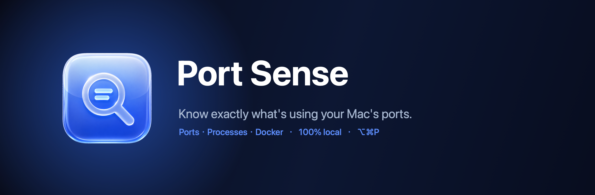
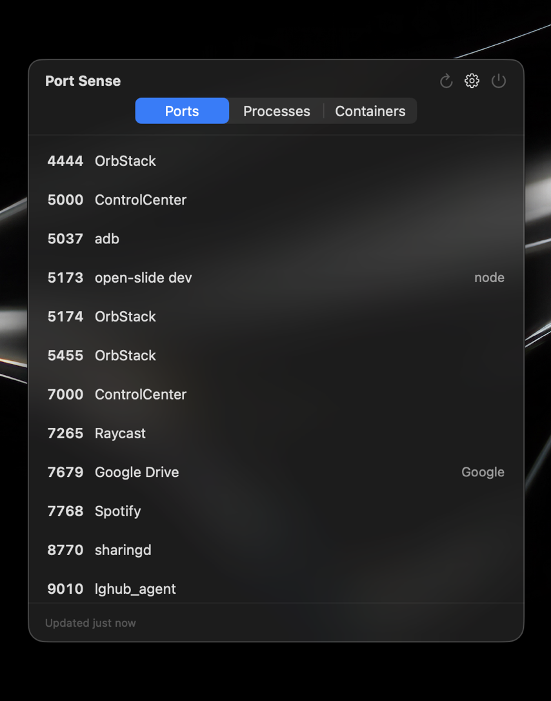
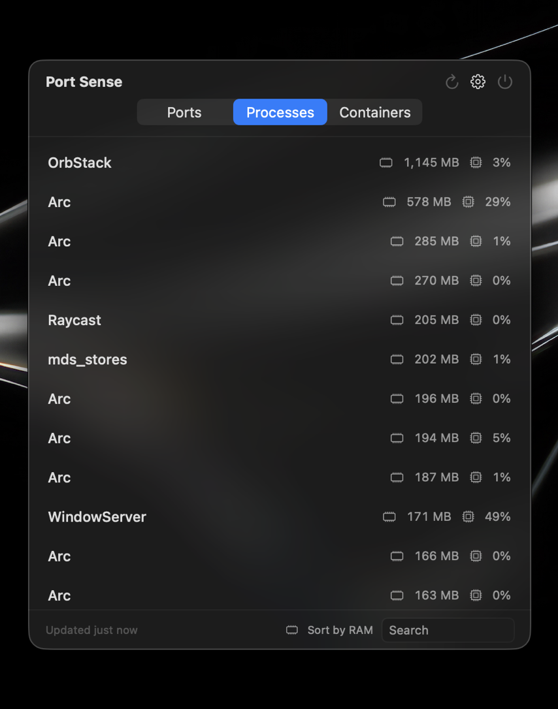
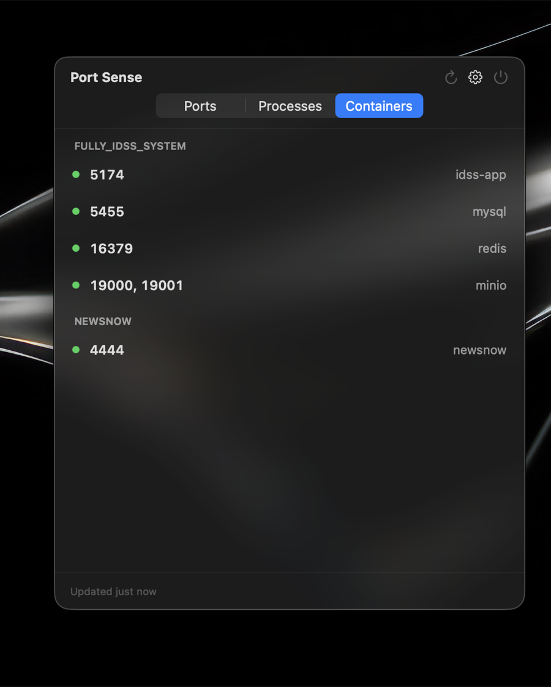

<div align="center">



[](https://github.com/Yacolate0519-cmd/PortSense/releases/latest)
&nbsp;

&nbsp;

&nbsp;
[](LICENSE)

</div>

---

Ever hit **"port already in use"** and had no idea which app to blame? Or wondered
what that random `localhost:5173` is? **Port Sense** lives in your menu bar and
tells you — in plain language — exactly what's running on every port.

```
5173  open-slide (Vite dev server)
5554  Android Emulator (Medium_Phone_API_36.1)
3000  Next.js server
7679  Google Drive
```

No more cryptic `lsof` output. Just the answer.

<div align="center">
<table>
  <tr>
    <td align="center" width="33%"><b>Ports</b></td>
    <td align="center" width="33%"><b>Processes</b></td>
    <td align="center" width="33%"><b>Containers</b></td>
  </tr>
  <tr>
    <td align="center"></td>
    <td align="center"></td>
    <td align="center"></td>
  </tr>
</table>
</div>

## ✨ What it does

- **🔌 See every open port** — every listening port on your Mac, with the actual
  app or tool behind it (not a vague `node` or `qemu`).
- **📊 Spot what's hogging your Mac** — a Processes view with live memory and CPU,
  sortable by either, so you can find the resource hog fast.
- **🐳 Peek into Docker** — your running containers grouped by project, with the
  ports they expose.
- **⚡ Fix it in one click** — open a port in your browser, or kill a stuck
  process (it asks before force-quitting).
- **⌨️ Always one shortcut away** — press **⌥⌘P** from anywhere to toggle the
  window open or closed — even over a full-screen app — or open it from the menu
  bar or the Dock.
- **🔒 Private by design** — everything runs locally. No network, no accounts,
  no tracking.

## 🎯 Who it's for

Developers. If you run dev servers, databases, simulators, or Docker, Port Sense
saves you the "what's on this port / why won't this port free up" detective work.

## 📦 Install

1. Download **Port Sense.dmg** from the [latest release](https://github.com/Yacolate0519-cmd/PortSense/releases/latest).
2. Open it and drag **Port Sense** into Applications.
3. Launch it and press **⌥⌘P** (or click the icon in the menu bar).

> Signed with a Developer ID and notarized by Apple — it opens with a normal
> double-click, no Gatekeeper warnings.

## 🕹 Using it

| Action | How |
|--------|-----|
| Show / hide the window | **⌥⌘P** from anywhere |
| Open it | Click the menu bar or Dock icon |
| Open a port / kill a process | Hover a row → the buttons appear |
| Start with your Mac | Gear menu → **Launch at Login** |
| Reopen in the same spot | Gear menu → **Remember Window Position** |

## 🛠 Build from source

Requires macOS 13+ and Xcode 15+.

```bash
git clone https://github.com/Yacolate0519-cmd/PortSense.git
cd PortSense
open PortSense.xcodeproj   # then press ⌘R
```

Built natively in **Swift / SwiftUI** with no third-party dependencies.

## License

[MIT](./LICENSE)
